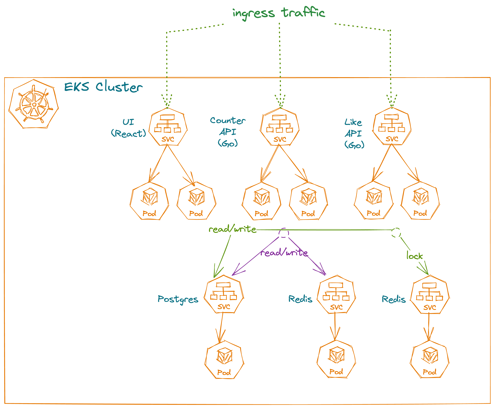

## Amazon EKS LitmusChaos Demo

This repository contains sample templates and microservices for a session on Chaos Engineering at AWS Summit ASEAN 2023.

## Usage

### Sample Workloads


#### Likes Web App



### Configure Variables

Replace values.yaml in examples/helm/likes-web-app with your aws account id and region to specify the URI of the images that will be pushed later:
```
counter_service:
  image: $AWS_ACCOUNT_ID.dkr.ecr.$AWS_REGION.amazonaws.com/counter-service:v1.0.0

like_service:
  image: $AWS_ACCOUNT_ID.dkr.ecr.$AWS_REGION.amazonaws.com/like-service:v1.0.0

ui-app:
  image: $AWS_ACCOUNT_ID.dkr.ecr.$AWS_REGION.amazonaws.com/ui-app:v1.0.0
```

Replace the values accordingly and set the env variables in your shell.
```
export AWS_ACCOUNT_ID=REPLACE_ME
export AWS_REGION=REPLACE_ME
```

### Deploy Observability and ECR resources

```
cd examples/terraform/core
terraform apply
```

### Deploy Amazon EKS

```
cd examples/terraform/eks-cluster
terraform apply
```

### Configure API
In `src/ui-app/src/config/index.js`, set `local` to `false` and configure the `API_BASE_URL` to the Istio ingress gateway hostname that was deployed in the earlier step.

### Deploy Microservices & UI

```
aws ecr get-login-password --region $AWS_REGION | docker login --username AWS --password-stdin $AWS_ACCOUNT_ID.dkr.ecr.$AWS_REGION.amazonaws.com

docker build --platform linux/amd64 -t counter-service src/counter-service
docker tag counter-service:latest $AWS_ACCOUNT_ID.dkr.ecr.$AWS_REGION.amazonaws.com/counter-service:v1.0.0
docker push $AWS_ACCOUNT_ID.dkr.ecr.$AWS_REGION.amazonaws.com/counter-service:v1.0.0

docker build --platform linux/amd64 -t like-service src/like-service
docker tag like-service:latest $AWS_ACCOUNT_ID.dkr.ecr.$AWS_REGION.amazonaws.com/like-service:v1.0.0
docker push $AWS_ACCOUNT_ID.dkr.ecr.$AWS_REGION.amazonaws.com/like-service:v1.0.0

docker build --platform linux/amd64 -t ui-app src/ui-app
docker tag ui-app:latest $AWS_ACCOUNT_ID.dkr.ecr.$AWS_REGION.amazonaws.com/ui-app:v1.0.0
docker push $AWS_ACCOUNT_ID.dkr.ecr.$AWS_REGION.amazonaws.com/ui-app:v1.0.0
```

## Security

See [CONTRIBUTING](CONTRIBUTING.md#security-issue-notifications) for more information.

## License

This library is licensed under the MIT-0 License. See the LICENSE file.